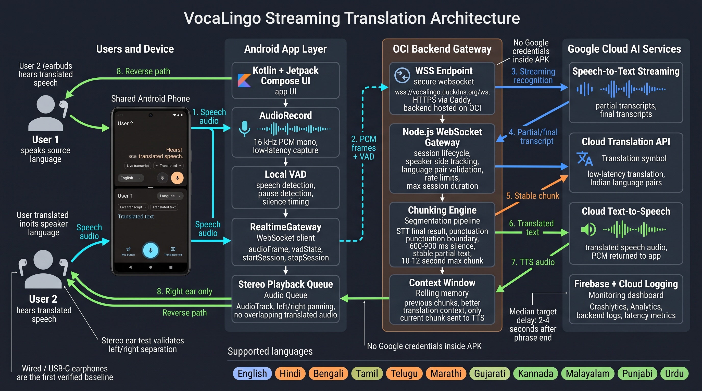

# VocaLingo

VocaLingo is a native Android streaming translator for two people sharing one phone. Each person selects a language and uses a separate side of the screen. The app captures speech, streams audio to a backend gateway, translates stable speech chunks, synthesizes translated speech, and plays the result into the listener's ear channel.

Live showcase: [vocalingo-showcase.vercel.app](https://vocalingo-showcase.vercel.app/)

## Architecture



## What It Does

- Lets two users share one Android phone for bilingual conversation.
- Uses a split-screen UI with one panel per participant.
- Streams speech continuously instead of waiting for long monologues to finish.
- Chunks speech using STT finalization, punctuation, silence timing, stable partials, and max duration limits.
- Routes translated speech to the opposite listener using stereo PCM playback.
- Keeps Google Cloud service credentials on the backend, not in the APK.

## Tech Stack

| Layer | Technology |
| --- | --- |
| Android app | Kotlin, Jetpack Compose, Coroutines/Flow |
| Audio capture | Android `AudioRecord`, 16 kHz PCM mono |
| Local speech timing | Voice activity detection |
| Playback | Android `AudioTrack` with stereo panning |
| Backend | Node.js WebSocket gateway |
| Hosting | OCI VM with HTTPS/WSS proxying |
| AI services | Google Cloud Speech-to-Text, Translation API, Text-to-Speech |
| Monitoring | Firebase Crashlytics/Analytics, backend logs |
| Showcase site | Static HTML/CSS on Vercel |

## Repository Structure

```text
.
+-- app/                   # Native Android app
+-- backend/               # Node.js realtime gateway
+-- site/                  # Static showcase website
+-- PRODUCTION.md          # Production/deployment notes
+-- TECHNICAL_ANALYSIS.md  # Detailed technical analysis
+-- README.md
```

## Runtime Flow

1. A user taps or holds the mic control.
2. Android records PCM audio and emits VAD state.
3. The app streams audio frames over WSS to the backend.
4. Backend forwards audio to Google Speech-to-Text streaming.
5. Stable chunks are translated through Cloud Translation.
6. Translated text is synthesized with Cloud Text-to-Speech.
7. Android receives PCM audio and queues playback for the opposite ear channel.

## Backend Endpoint

Production WebSocket endpoint:

```text
wss://vocalingo.duckdns.org/ws
```

Production health endpoint:

```text
https://vocalingo.duckdns.org/health
```

## Local Development

### Android

```powershell
.\gradlew.bat :app:assembleDebug
.\gradlew.bat :app:testDebugUnitTest
```

The debug build can use emulator-local cleartext networking where configured. Release builds are expected to use HTTPS/WSS.

### Backend

```powershell
cd backend
npm install
npm test
npm start
```

Useful backend environment variables are documented in [backend/README.md](backend/README.md).

### Showcase Site

The website is static and lives in [site/](site/).

```powershell
cd site
vercel deploy --prod
```

## Configuration And Secrets

Do not commit:

- `app/google-services.json`
- `keystore.properties`
- release keystores
- Google service-account JSON files
- backend production `.env` files

The repository includes safe examples such as [keystore.properties.sample](keystore.properties.sample) and backend `.env` examples.

## Key Documentation

- [Technical Analysis](TECHNICAL_ANALYSIS.md)
- [Production Notes](PRODUCTION.md)
- [Backend README](backend/README.md)
- [Showcase Site](site/)

## Current Scope

VocaLingo v1 is Android-first and internet-required. Wired or USB-C earphones are the first reliable stereo baseline; Bluetooth behavior depends on device routing and should be validated with the in-app ear test.
